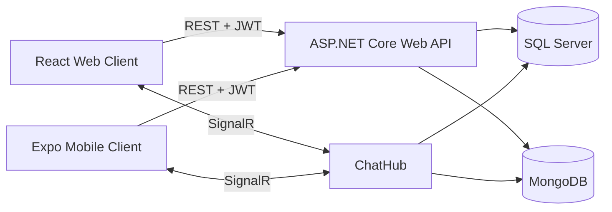

# VeloChat — Real-Time Messaging for Web and Mobile

VeloChat is a real-time messaging application built as a monorepo with an **ASP.NET Core 10 Web API**, a **React + Vite web client**, and an **Expo React Native mobile app**.

> မြန်မာဘာသာဖြင့်ဖတ်ရန်: **[README.my.md](./README.my.md)**

## Applications

| Project | Technology | Purpose |
| --- | --- | --- |
| [`VeloChat.WebAPI`](./VeloChat.WebAPI) | ASP.NET Core 10, SignalR | REST API, authentication, friends, profiles, and real-time chat |
| [`VeloChat.Client`](./VeloChat.Client) | React, Vite | Browser-based web client |
| [`VeloChat.Mobile`](./VeloChat.Mobile) | React Native, Expo | Android and iOS mobile client |



## Features

- Register, login, logout, access-token refresh, and refresh-token rotation
- Mobile splash-screen session restoration with tokens stored in SecureStore
- Friend search, requests, friend lists, and friend profile viewing
- Real-time direct chat, online status, and typing indicators through SignalR
- Editable profile, password change, and light/dark themes
- SQL Server for identity and relational data; MongoDB for messages
- Responsive web UI plus an Expo-based Android/iOS UI

## Prerequisites

- .NET 10 SDK
- Node.js 18 or newer
- SQL Server
- MongoDB at `mongodb://localhost:27017`, unless configured differently
- Expo Go on a physical phone, or an Android/iOS emulator for mobile testing

## 1. Start the backend

From the repository root:

```powershell
dotnet ef database update --project VeloChat.WebAPI
dotnet run --project VeloChat.WebAPI --launch-profile https
```

This launch profile exposes both endpoints:

- Web/local HTTPS: `https://localhost:7010`
- Phone/LAN HTTP: `http://<YOUR-PC-IP>:5027`
- Scalar API docs: `https://localhost:7010/scalar/v1`

Update the database connection strings in `VeloChat.WebAPI/appsettings.json` when your local SQL Server or MongoDB configuration is different.

## 2. Run the web client

Open another terminal:

```powershell
cd VeloChat.Client
npm install
npm run dev
```

Open `http://localhost:5173`. The web client can use the backend's localhost HTTPS address.

## 3. Test the mobile app on a physical phone

The phone and development PC must be connected to the same Wi-Fi network.

1. Find the PC's Wi-Fi IPv4 address:

   ```powershell
   ipconfig
   ```

   Look under **Wireless LAN adapter Wi-Fi** for **IPv4 Address**.

2. Create the mobile environment file:

   ```powershell
   cd VeloChat.Mobile
   Copy-Item .env.example .env
   ```

3. Edit `VeloChat.Mobile/.env` using the PC's LAN IP. For example:

   ```dotenv
   EXPO_PUBLIC_API_URL=http://192.168.100.72:5027
   ```

   Do not use `localhost` here: on a physical phone, `localhost` means the phone itself.

4. Install packages and start Expo in LAN mode:

   ```powershell
   npm install
   npx expo start --clear --lan
   ```

5. Open the latest **Expo Go** on the phone and scan the QR code.

6. If the app cannot reach the API, first open this URL in the phone browser:

   ```text
   http://<YOUR-PC-IP>:5027/scalar/v1
   ```

   If it does not open, allow the backend through Windows Firewall on private networks, confirm both devices are on the same Wi-Fi, and temporarily disconnect any VPN that isolates local traffic.

## Mobile emulator API addresses

| Test target | `EXPO_PUBLIC_API_URL` |
| --- | --- |
| Physical phone | `http://<YOUR-PC-IP>:5027` |
| Android emulator | `http://10.0.2.2:5027` |
| iOS simulator | `http://localhost:5027` |

Restart Expo with `npx expo start --clear` after changing `.env`.

## Why mobile uses HTTP during local development

The web browser on the development PC can trust the ASP.NET localhost development certificate and use `https://localhost:7010`. A physical phone cannot use the PC's `localhost`, and it normally does not trust that development certificate for a LAN IP. Therefore the phone uses `http://<YOUR-PC-IP>:5027` for local testing. A deployed production API should use HTTPS with a valid public certificate.

## Troubleshooting

### “Project is incompatible with this version of Expo Go”

- Update Expo Go from the App Store or Play Store.
- Stop the Expo server and run `npx expo start --clear --lan` again.
- Ensure you are opening this project's new QR code rather than an old project from Expo Go's recent list.

### “Network request failed” on mobile

- Check that the backend terminal shows `http://0.0.0.0:5027`.
- Verify the `.env` IP is the PC's current Wi-Fi IPv4 address.
- Test `http://<YOUR-PC-IP>:5027/scalar/v1` in the phone browser.
- Check Wi-Fi client isolation, VPN settings, and Windows Firewall.

## Useful source links

- [`AppDbContext.cs`](./VeloChat.WebAPI/Data/AppDbContext.cs)
- [`ChatHub.cs`](./VeloChat.WebAPI/Hubs/ChatHub.cs)
- [Mobile-specific README](./VeloChat.Mobile/README.md)
