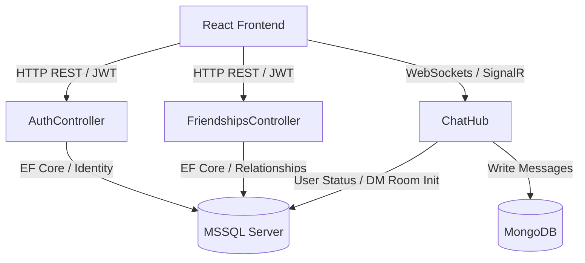

# VeloChat - Real-Time Glassmorphic Messaging App

An Expo React Native client is available in [`VeloChat.Mobile`](./VeloChat.Mobile). See its README for emulator/device API configuration and run commands.

VeloChat is a high-performance, real-time messaging application designed with a **monorepo architecture**. It consists of an **ASP.NET Core 10 Web API** backend and a responsive **React (Vite) SPA** client. 

---

## Localization / ဘာသာစကား
For the detailed documentation in Burmese (မြန်မာဘာသာ), please refer to:
👉 **[README.my.md](file:///c:/repos/Velo/Velo-Chat/README.my.md)**

---

## 1. System Architecture

VeloChat employs a dual-database strategy and web socket gateway to achieve high scalability, clean decoupling, and smooth real-time performance.



### Decoupled Monorepo Structure
- **`VeloChat.WebAPI`**: Contains the API controllers, entity configurations, database migrations, token generation services, and the SignalR WebSocket hub.
- **`VeloChat.Client`**: The frontend React workspace. It communicates with the backend REST APIs using an Axios wrapper and establishes a persistent SignalR socket for real-time traffic.

---

## 2. Backend Design (`VeloChat.WebAPI`)

### Database Design & Schema
VeloChat divides its data storage engines to optimize reads and writes.

#### Relational Schema (MSSQL)
EF Core maps relationships to the local SQL Server database using custom configuration in [AppDbContext.cs](file:///c:/repos/Velo/Velo-Chat/VeloChat.WebAPI/Data/AppDbContext.cs).
1. **`AspNetUsers`** (Identity User):
   - `Id` (GUID Primary Key)
   - `UserName` / `NormalizedUserName`
   - `Email` / `NormalizedEmail`
   - `PasswordHash`
   - `FullName` (custom string for search purposes)
   - `ProfilePictureUrl` (custom avatar links)
   - `IsOnline` (boolean flag toggled during login, SignalR connection, and logout/revocation)
   - `RefreshToken` / `RefreshTokenExpiryTime` (holds token rotation keys)
2. **`Friendships`**:
   - `Id` (Integer PK)
   - `UserId` (FK referencing the request sender)
   - `FriendId` (FK referencing the request recipient)
   - `Status` (string: `Pending` | `Accepted`)
   - `CreatedAt` (DateTime)
3. **`ChatRooms`**:
   - `Id` (GUID PK)
   - `RoomName` (string)
   - `IsGroupChat` (boolean)
   - `CreatedAt` (DateTime)
4. **`RoomParticipants`** (Composite table joining Users & ChatRooms):
   - `RoomId` (FK composite key)
   - `UserId` (FK composite key)
   - `JoinedAt` (DateTime)

#### Document-Store Collection (MongoDB)
MongoDB is selected for message persistence because of its high-throughput, schema-less properties.
1. **`Messages`**:
   - `Id` (MongoDB ObjectId)
   - `RoomId` (string representation of `ChatRoom.Id`)
   - `SenderId` (string representation of `ApplicationUser.Id`)
   - `SenderName` (string cache of username to avoid repetitive queries)
   - `Content` (string text content)
   - `Type` (string: `text` | `image` | `file`)
   - `MediaUrl` (optional string link to files/attachments)
   - `Timestamp` (DateTime UTC)

---

### Authentication & Token Rotation Flow
Secure communication is maintained using Bearer JWT. Instead of default cookie cookies, we implemented a custom Access + Refresh Token flow.

1. **Registration**: 
   - Requests hitting `POST /api/auth/register` receive a `RegisterDto` containing Username, FullName, Email, Password, and ProfilePictureUrl. Validations are executed via ASP.NET Core Identity.
2. **Login**: 
   - Requests hitting `POST /api/auth/login` validate credentials. Upon success, the server marks the user `IsOnline = true`, generates an **Access Token** (valid for 15 minutes) and a **Refresh Token** (cryptographically random string valid for 7 days), and updates the database with the new refresh token.
3. **Automatic Token Rotation**:
   - When the frontend attempts to run requests with an expired Access Token, it receives a `401 Unauthorized` response.
   - The frontend Axios interceptor intercepts this error, halts subsequent requests, and triggers a `POST /api/auth/refresh` request sending the current `AccessToken` and `RefreshToken`.
   - The server validates claims, checks if the refresh token in the database is not expired, issues a new `AccessToken` and `RefreshToken`, updates the database, and returns them to the client.
4. **Revocation**:
   - Hitting `POST /api/auth/revoke` clears the user's `RefreshToken` and `RefreshTokenExpiryTime` columns in MSSQL and sets `IsOnline = false`.

---

### Real-Time SignalR Gateway (`ChatHub`)
The WebSocket connection lifecycle is managed in [ChatHub.cs](file:///c:/repos/Velo/Velo-Chat/VeloChat.WebAPI/Hubs/ChatHub.cs).
- **Group Scoping**: When a client switches rooms, it invokes `JoinRoom(roomId)` and `LeaveRoom(roomId)` to receive messages broadcasted to that chat scope.
- **Message Pipeline**: Sending a message calls `SendMessage(roomId, content, type, mediaUrl)`. The hub persists the message to MongoDB and broadcasts it in real-time to all clients connected to that room.
- **Typing Indicator**: Client inputs dispatch `SendTyping(roomId, isTyping)`. The hub broadcasts the status dynamically (`ReceiveTyping`) to notify other group members.

---

## 3. Frontend Design (`VeloChat.Client`)

### Core Client Components
- **`AuthContext.jsx`**: A React Context provider that wraps the app, maintains auth state, and parses token payloads to obtain claims (user ID, username, email).
- **`api.js`**: An Axios wrapper that automatically appends the `Authorization: Bearer <token>` header to all backend HTTP calls. It features a response interceptor that queues requests if a `401` is received, requests token updates, and automatically retries the queued requests with the new tokens.
- **`Register.jsx` / `Login.jsx`**: Glassmorphic interfaces using CSS backdrop-filter styling.
- **`Chat.jsx`**: The main page layout containing:
  - Sidebar: Profile header, Quick-action buttons (New Chat, Add Friend toggle), Search results list, active chat rooms, active friends, and incoming friend requests.
  - Active Conversation Window: Message thread display, live typing notifications, message bubble components with attachment overlays, and the text editor.

---

## 4. Setup & Running Instructions

### Prerequisites
- **.NET 10 SDK** installed.
- **Node.js (v18+)** installed.
- **MSSQL Server** running on `localhost`.
- **MongoDB** running on `localhost:27017`.

### Steps

#### 1. Setup Database & Start Backend
1. Navigate to the WebAPI directory:
   ```powershell
   cd VeloChat.WebAPI
   ```
2. Update the connection strings in `appsettings.json` if your local configurations differ.
3. Apply database migrations to generate tables:
   ```powershell
   dotnet ef database update
   ```
4. Run the Web API:
   ```powershell
   dotnet run
   ```
   The backend runs on `https://localhost:7010`. Access the interactive Scalar API documentation at `https://localhost:7010/scalar/v1`.

#### 2. Start Frontend Client
1. Open a new terminal and navigate to the client directory:
   ```powershell
   cd VeloChat.Client
   ```
2. Install npm dependencies:
   ```powershell
   npm install
   ```
3. Start the local Vite server:
   ```powershell
   npm run dev
   ```
4. Open your browser to `http://localhost:5173`.
