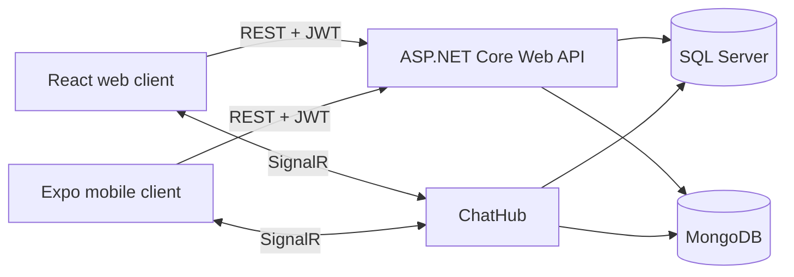
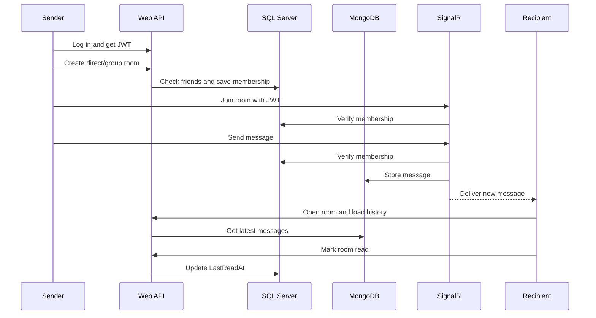

# VeloChat — Real-Time Messaging for Web and Mobile

VeloChat is a chat app built with ASP.NET Core 10, SignalR, React/Vite, and Expo React Native. SQL Server stores users, friendships, rooms, and read positions; MongoDB stores messages. See the [မြန်မာဘာသာ README](./README.my.md).

## Applications and architecture

| Project | Purpose |
| --- | --- |
| `VeloChat.WebAPI` | Authentication, friends, rooms, messages, and SignalR hub |
| `VeloChat.Client` | React web client |
| `VeloChat.Mobile` | Expo app for Android and iOS |


```mermaid
flowchart LR
    Web[React web client] -->|REST + JWT| API[ASP.NET Core Web API]
    Mobile[Expo mobile client] -->|REST + JWT| API
    Web <-->|SignalR| Hub[ChatHub]
    Mobile <-->|SignalR| Hub
    API --> SQL[(SQL Server)]
    API --> Mongo[(MongoDB)]
    Hub --> SQL
    Hub --> Mongo
```

## Features

- Register, log in, log out, refresh tokens, edit profiles, and change passwords. Mobile restores saved sessions from SecureStore.
- Search for users, send and accept friend requests, and start direct chats with accepted friends.
- Create group rooms, add accepted friends to an existing group, and see participants. Adding a member takes effect immediately; there is no separate invitation acceptance.
- Send and receive messages in real time, see online presence and typing indicators, and use light or dark themes.
- Load older messages with cursor pagination. The API defaults to 50 messages per page and accepts up to 100; clients display them oldest to newest.
- See unread counts for rooms. Opening a room updates that member's last read time and clears its count.
- Check membership before message history and room actions. The join endpoint does not let arbitrary users enter a room.

Per-message read receipts, push notifications, and file uploads are not implemented yet.

## Chat flow


```mermaid
sequenceDiagram
    participant A as Sender
    participant API as Web API
    participant SQL as SQL Server
    participant Mongo as MongoDB
    participant Hub as SignalR
    participant B as Recipient
    A->>API: Log in and get JWT
    A->>API: Create direct/group room
    API->>SQL: Check friends and save membership
    A->>Hub: Join room with JWT
    Hub->>SQL: Verify membership
    A->>Hub: Send message
    Hub->>SQL: Verify membership
    Hub->>Mongo: Store message
    Hub-->>B: Deliver new message
    B->>API: Open room and load history
    API->>Mongo: Get latest messages
    B->>API: Mark room read
    API->>SQL: Update LastReadAt
```

Friends must accept a request before a direct room can be started or a person can be added to a group. When a client opens a room, it loads recent history, joins the SignalR room, and marks the room read. The client can request older history using the `before` cursor. Unread counts use each participant's `LastReadAt`.

## Prerequisites

- .NET 10 SDK and the `dotnet-ef` tool
- Node.js 18+ and pnpm 10 (the repository specifies pnpm 10.14.0)
- SQL Server and MongoDB
- Expo Go on a phone, or an Android/iOS emulator, for mobile development

## Run locally

Configure the SQL Server and MongoDB connection strings and JWT settings in the API's local development configuration. Keep production credentials outside the repository. From the repository root, apply migrations and start the API:

```powershell
dotnet ef database update --project VeloChat.WebAPI
dotnet run --project VeloChat.WebAPI --launch-profile https
```

The `AddRoomLastReadAt` migration adds the room read position used by unread counts. Apply it after updating an existing checkout. The HTTPS profile listens at `https://localhost:7010` and `http://0.0.0.0:5027` for local device testing. In Development, Scalar API docs are at `https://localhost:7010/scalar/v1`.

In a second terminal, install packages and start the web client:

```powershell
pnpm install
pnpm web
```

Open `http://localhost:5173`. To try the chat flow, create two accounts, send a friend request from one, accept it from the other, then open a direct chat or create a group. Use two browser sessions to see live messages, typing, and unread counts.

## Run on a physical phone

1. Connect the phone and development PC to the same Wi-Fi network.
2. Run `ipconfig` and find the PC's Wi-Fi IPv4 address.
3. Copy `VeloChat.Mobile/.env.example` to `VeloChat.Mobile/.env`.
4. Set `EXPO_PUBLIC_API_URL=http://<YOUR-PC-IP>:5027` in that `.env` file, using the actual IPv4 address.
5. Run `pnpm mobile --clear --lan` from the repository root.
6. Scan the QR code with Expo Go. If the app cannot connect, check that the phone can reach `http://<YOUR-PC-IP>:5027/scalar/v1` in its browser.

| Device | `EXPO_PUBLIC_API_URL` |
| --- | --- |
| Physical phone | `http://<YOUR-PC-IP>:5027` |
| Android emulator | `http://10.0.2.2:5027` |
| iOS simulator | `http://localhost:5027` |

Restart Expo whenever `.env` changes. A phone's `localhost` points to the phone, and a local development HTTPS certificate is not trusted by default on a physical device. Port 5027 is for local development; use HTTPS with a valid certificate in production. See the [mobile README](./VeloChat.Mobile/README.md) for more device details.

## Troubleshooting

| Symptom | Check |
| --- | --- |
| API fails at startup | Confirm SQL Server and MongoDB are running, local connection strings are correct, and migrations have been applied. |
| Browser rejects the local HTTPS API | Trust the .NET development certificate with `dotnet dev-certs https --trust`, then restart the browser and API. |
| Mobile says “Network request failed” | Check the phone and PC network, the PC IPv4 address in `.env`, port 5027, Windows Firewall, VPN, and Wi-Fi client isolation. Restart Expo after changing `.env`. |
| Expo Go reports an SDK mismatch | Use an Expo Go version compatible with the project's Expo SDK or a matching emulator build. |
| Messages do not appear live | Confirm both clients are authenticated, connected to the API, and members of the same room; reload to compare stored history. |

## Project checks

```powershell
dotnet build VeloChat.WebAPI/VeloChat.WebAPI.csproj
pnpm build
pnpm typecheck
pnpm lint
```

## License

VeloChat is available under the [MIT License](./LICENSE).
