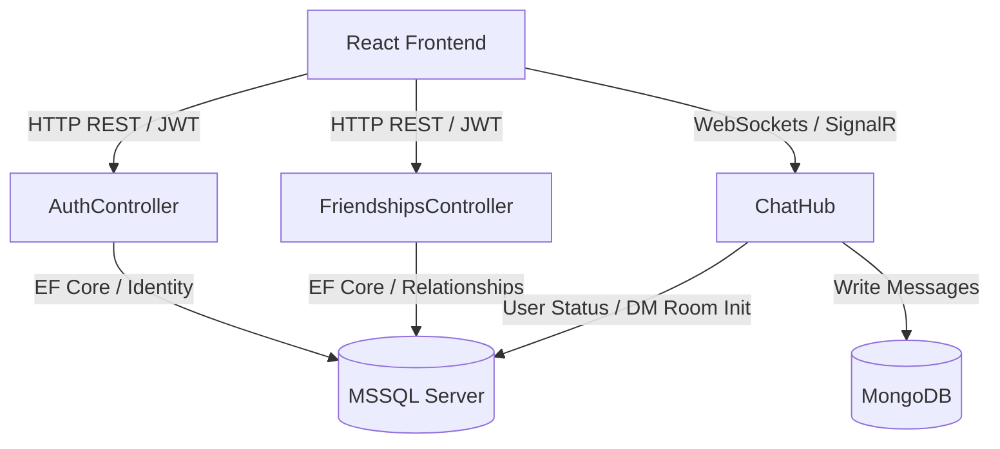

# VeloChat - Real-Time Glassmorphic Messaging App (မြန်မာဘာသာ)

VeloChat သည် စွမ်းဆောင်ရည်မြင့်မားသော **ASP.NET Core 10 Web API** backend နှင့် လှပသပ်ရပ်သော **React (Vite) SPA** client တို့ကို ပေါင်းစပ်ဖန်တီးထားသည့် real-time စကားပြော (messaging) စနစ်ဖြစ်ပြီး **Monorepo Architecture** ပုံစံဖြင့် တည်ဆောက်ထားပါသည်။

---

## ဘာသာစကား ရွေးချယ်ရန် / Language
အင်္ဂလိပ်ဘာသာဖြင့် ရေးသားထားသော မူရင်းနည်းပညာဆိုင်ရာ အသေးစိတ်လမ်းညွှန်ချက်ကို ဤနေရာတွင် ဖတ်ရှုနိုင်သည် -
👉 **[README.md](file:///c:/repos/Velo/Velo-Chat/README.md)**

---

## ၁။ စနစ်၏ တည်ဆောက်ပုံ (System Architecture)

VeloChat သည် အချိန်နှင့်တပြေးညီ (real-time) စာတိုပေးပို့မှုများကို မြန်ဆန်ချောမွေ့စေရန်နှင့် server စွမ်းဆောင်ရည်ကို မြှင့်တင်ရန် database နှစ်ခု ပူးတွဲအသုံးပြုသည့်စနစ် (dual-database strategy) ကို အသုံးပြုထားသည်။



### ပရောဂျက် တည်ဆောက်ပုံခွဲခြားမှု
- **`VeloChat.WebAPI`**: Backend ဝန်ဆောင်မှုများဖြစ်ပြီး API Controller များ၊ Entity Model များ၊ Database Migrations များနှင့် SignalR Socket Hub များ ပါဝင်သည်။
- **`VeloChat.Client`**: Frontend React Client ဖြစ်ပြီး backend REST APIs များနှင့် ချိတ်ဆက်ရန် Axios wrapper ကိုလည်းကောင်း၊ Real-time updates များအတွက် SignalR Websocket link ကိုလည်းကောင်း အသုံးပြုသည်။

---

## ၂။ Backend ဒီဇိုင်းနှင့် လုပ်ဆောင်ချက်များ (`VeloChat.WebAPI`)

### Database ပုံစံများ (Schema Design)
စနစ်၏ performance ကို ကောင်းမွန်စေရန် relational data များနှင့် chat message data များကို database သီးခြားစီတွင် ခွဲခြားသိမ်းဆည်းထားသည်။

#### Relational Schema (MSSQL Database)
Entity Framework Core ကို အသုံးပြု၍ local SQL Server ပေါ်တွင် table များကို အောက်ပါအတိုင်း ချိတ်ဆက်တည်ဆောက်ထားပါသည် -
1. **`AspNetUsers`** (Identity User):
   - `Id` (GUID Primary Key)
   - `UserName` / `NormalizedUserName`
   - `Email` / `NormalizedEmail`
   - `PasswordHash`
   - `FullName` (အသုံးပြုသူ ရှာဖွေရာတွင် သုံးရန် ကိုယ်ပိုင်အမည်ဖြည့်စွက်ချက်)
   - `ProfilePictureUrl` (Profile ဓာတ်ပုံလင့်ခ်များ)
   - `IsOnline` (အသုံးပြုသူ online ရှိ/မရှိ ပြသရန် boolean flag)
   - `RefreshToken` / `RefreshTokenExpiryTime` (Token သက်တမ်းတိုးရန်အတွက် သုံးသော encryption keys)
2. **`Friendships`** (သူငယ်ချင်း ချိတ်ဆက်မှုဇယား):
   - `Id` (Integer PK)
   - `UserId` (Friend request ပို့သူ၏ FK)
   - `FriendId` (Friend request လက်ခံသူ၏ FK)
   - `Status` (ဆက်သွယ်မှုအခြေအနေ: `Pending` | `Accepted`)
   - `CreatedAt` (အချိန်မှတ်တမ်း)
3. **`ChatRooms`** (စကားပြောခန်းများ):
   - `Id` (GUID PK)
   - `RoomName` (အခန်းအမည်)
   - `IsGroupChat` (Group ဖြစ်မဖြစ် boolean flag)
   - `CreatedAt` (ဖန်တီးသည့်အချိန်)
4. **`RoomParticipants`** (အသုံးပြုသူနှင့် စကားပြောခန်း ချိတ်ဆက်မှုဇယား):
   - `RoomId` (စကားပြောခန်း FK - Composite Key)
   - `UserId` (အသုံးပြုသူ FK - Composite Key)
   - `JoinedAt` (စတင်ဝင်ရောက်သည့်အချိန်)

#### Document-Store Collection (MongoDB)
မြန်ဆန်သော စာရေး/စာဖတ်စနစ်အတွက် chat messages များကို schema-less database ဖြစ်သော MongoDB တွင် အောက်ပါအတိုင်း သိမ်းဆည်းပါသည် -
1. **`Messages`**:
   - `Id` (MongoDB ObjectId)
   - `RoomId` (စကားပြောခန်း၏ ID ဖြစ်ပြီး `ChatRoom.Id` နှင့် ချိတ်ဆက်ထားသည်)
   - `SenderId` (စာပို့သူ၏ User ID ဖြစ်ပြီး `ApplicationUser.Id` နှင့် ကိုက်ညီသည်)
   - `SenderName` (စာပို့သူ၏ Username အား API querying သက်သာစေရန် ဤနေရာတွင် တိုက်ရိုက် cache လုပ်ထားသည်)
   - `Content` (စာသားပါဝင်မှု)
   - `Type` (အမျိုးအစား: `text` | `image` | `file`)
   - `MediaUrl` (ဓာတ်ပုံ သို့မဟုတ် file ပူးတွဲပါက ၎င်း၏လင့်ခ်)
   - `Timestamp` (စာပို့သည့်အချိန်မှတ်တမ်း UTC)

---

### Authentication နှင့် Token သက်တမ်းတိုးခြင်း လုပ်ငန်းစဉ် (Token Rotation Flow)
စနစ်လုံခြုံရေးအတွက် Custom JWT Bearer Token (Access Token နှင့် Refresh Token) စနစ်ကို အောက်ပါလုပ်ငန်းစဉ်အတိုင်း အသုံးပြုထားပါသည် -

1. **Registration (အကောင့်ဖွင့်ခြင်း)**: 
   - `POST /api/auth/register` သို့ Username, FullName, Email, Password နှင့် ProfilePictureUrl ပါဝင်သော `RegisterDto` ပေးပို့ပြီး အကောင့်ဖွင့်နိုင်သည်။
2. **Login (ဝင်ရောက်ခြင်း)**: 
   - `POST /api/auth/login` သို့ ဝင်ရောက်ပြီး အထောက်အထားမှန်ကန်ပါက user အား `IsOnline = true` ပြောင်းလဲပြီး သက်တမ်း ၁၅ မိနစ်ရှိသော **Access Token** နှင့် သက်တမ်း ၇ ရက်ရှိသော **Refresh Token** ကို ထုတ်ပေးပြီး MSSQL တွင် သိမ်းဆည်းသည်။
3. **Automatic Token Rotation (အလိုအလျောက် သက်တမ်းတိုးခြင်း)**:
   - Access Token သက်တမ်းကုန်ဆုံးသွားပြီးနောက် client မှ API သို့ ခေါ်ယူပါက `401 Unauthorized` error ပြန်လာမည်ဖြစ်သည်။
   - Frontend client ရှိ Axios interceptor သည် ၎င်း 401 error ကို တွေ့သည်နှင့် ကျန်ရှိသော API calls များကို ခေတ္တရပ်ဆိုင်း (halt) ကာ `POST /api/auth/refresh` သို့ လက်ရှိ `AccessToken` နှင့် `RefreshToken` ပေးပို့၍ Token အသစ် တောင်းခံမည်ဖြစ်သည်။
   - Server မှ သက်တမ်းကိုစစ်ဆေးပြီး မှန်ကန်ပါက token အသစ်အတွဲကို database တွင် update လုပ်ကာ client သို့ ပြန်လည်ပေးပို့ပြီး ခေတ္တဆိုင်းငံ့ထားသော API calls များကို token အသစ်ဖြင့် ဆက်လက်လုပ်ဆောင်စေမည်ဖြစ်သည်။
4. **Revocation (ထွက်ခွာခြင်း)**:
   - `POST /api/auth/revoke` သို့ ဝင်ရောက်ပြီး user ၏ refresh token ကို database မှ ဖျက်သိမ်းကာ `IsOnline = false` သို့ ပြောင်းလဲပေးသည်။

---

### Real-Time SignalR Gateway (`ChatHub`)
အချိန်နှင့်တပြေးညီ အပြန်အလှန်ချိတ်ဆက်မှုများအတွက် Websocket framework ဖြစ်သော SignalR ကို အသုံးပြုထားသည် -
- **Group Scoping**: Client က room တစ်ခုခုကို ရွေးချယ်လိုက်သည်နှင့် server ပေါ်တွင် `JoinRoom(roomId)` ကို ခေါ်ယူပြီး ယခင် room ထဲမှ ထွက်ရန် `LeaveRoom(roomId)` ကို ခေါ်ယူသည်။ သို့ဖြစ်ရာ message များသည် သက်ဆိုင်ရာ room ထဲရှိသူများထံသာ စီးဆင်းမည်ဖြစ်သည်။
- **Message Pipeline**: စာတိုပေးပို့ရန် `SendMessage` ကို ခေါ်ယူလိုက်ပါက backend သည် စာတိုကို MongoDB သို့ ချက်ချင်းသိမ်းဆည်းပြီး room ထဲရှိ active ဖြစ်နေသော user အားလုံးထံ ချက်ချင်း broadcast ပို့ပေးမည်ဖြစ်သည်။
- **Typing Indicator**: စာရိုက်နေစဉ်တွင် client မှ `SendTyping(roomId, isTyping)` ကို လှမ်းခေါ်ပြီး အခြားအဖွဲ့ဝင်များထံသို့ `test_user is typing...` စာသားကို dynamic ပြသပေးသည်။

---

## ၃။ Frontend ဒီဇိုင်းနှင့် တည်ဆောက်ပုံ (`VeloChat.Client`)

- **`AuthContext.jsx`**: တစ်ပတ်ရစ် app လည်ပတ်မှုအတွက် login state၊ logout flow များကို ထိန်းသိမ်းပေးပြီး token payload မှ claims (user ID, username, email) များကို parse လုပ်ယူသည်။
- **`api.js`**: Axios connection wrapper ဖြစ်ပြီး API calls တိုင်းတွင် `Authorization: Bearer <token>` ကို အလိုအလျောက် ပေါင်းထည့်ပေးသည်။ 401 error ရရှိပါက အလိုအလျောက် token သက်တမ်းတိုးပေးသည့် interceptor ပါဝင်သည်။
- **`Register.jsx` / `Login.jsx`**: Glassmorphism ဆန်ဆန် လှပသော ဝင်ရောက်ရန် စာမျက်နှာများ။
- **`Chat.jsx`**: အဓိက chat panel ကြီးဖြစ်ပြီး ၎င်းတွင် -
  - Sidebar: Profile၊ အမြန်ခလုတ်များ (New Chat စတင်ရန်နှင့် Add Friend toggle လုပ်ရန်)၊ dynamic user search list၊ chat rooms၊ သူငယ်ချင်းစာရင်းနှင့် friend request စောင့်ဆိုင်းနေမှုများ ပါဝင်သည်။
  - Conversation Window: စာတိုများ လည်ပတ်စီးဆင်းမှု၊ typing indicator အန်နီမေးရှင်းများ၊ ဓာတ်ပုံ attachments များပြသမှုနှင့် message input box။

---

## ၄။ စနစ်အား စတင်လည်ပတ်ပုံ (Run Instructions)

### လိုအပ်ချက်များ
- **.NET 10 SDK** တင်ထားရန်။
- **Node.js (v18 သို့မဟုတ် ထို့ထက်မြင့်သော version)** တင်ထားရန်။
- **MSSQL Server** (SQL Express သို့မဟုတ် LocalDB) run ထားရန်။
- **MongoDB** (`mongodb://localhost:27017` တွင် run ထားရန်)။

### အဆင့်ဆင့် လုပ်ဆောင်ရန်

#### ၁။ Database tables များဆောက်ပြီး Backend စတင်ခြင်း
1. Terminal တစ်ခုဖွင့်ပြီး backend folder ထဲသို့ ဝင်ပါ:
   ```powershell
   cd VeloChat.WebAPI
   ```
2. လိုအပ်ပါက `appsettings.json` တွင် local database ချိတ်ဆက်မှု လိပ်စာများကို ပြင်ဆင်ပါ။
3. Database ဇယားများ တည်ဆောက်ရန် migration ကို apply လုပ်ပါ:
   ```powershell
   dotnet ef database update
   ```
4. Backend API ကို စတင်လည်ပတ်စေပါ:
   ```powershell
   dotnet run
   ```
   Backend သည် `https://localhost:7010` တွင် စတင်လည်ပတ်မည် ဖြစ်ပြီး Scalar API စမ်းသပ်ခန်းကို `https://localhost:7010/scalar/v1` တွင် ဝင်ရောက်ကြည့်ရှုနိုင်သည်။

#### ၂။ Frontend Client စတင်ခြင်း
1. Terminal အသစ်တစ်ခုထပ်ဖွင့်ပြီး client folder ထဲသို့ ဝင်ပါ:
   ```powershell
   cd VeloChat.Client
   ```
2. လိုအပ်သော packages များ ထည့်သွင်းပါ:
   ```powershell
   npm install
   ```
3. Vite Development server ကို စတင်ပါ:
   ```powershell
   npm run dev
   ```
4. ဘရောက်ဇာတွင် `http://localhost:5173` သို့ သွားရောက်ပြီး စတင်အသုံးပြုနိုင်ပါပြီ။
