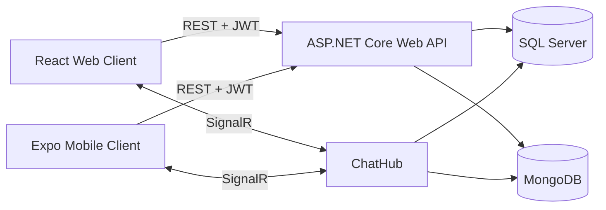

# VeloChat — Web နှင့် Mobile Real-Time Messaging App

VeloChat သည် **ASP.NET Core 10 Web API**, **React + Vite Web Client** နှင့် **Expo React Native Mobile App** တို့ပါဝင်သည့် real-time messaging monorepo project ဖြစ်သည်။ ယခုအခါ browser အပြင် Android နှင့် iOS mobile device များတွင်ပါ အသုံးပြုစမ်းသပ်နိုင်ပြီဖြစ်သည်။

> English ဖြင့်ဖတ်ရန်: **[README.md](./README.md)**

## Project များ

| Project | နည်းပညာ | အသုံးပြုပုံ |
| --- | --- | --- |
| [`VeloChat.WebAPI`](./VeloChat.WebAPI) | ASP.NET Core 10, SignalR | REST API, authentication, friend, profile နှင့် real-time chat |
| [`VeloChat.Client`](./VeloChat.Client) | React, Vite | Browser တွင်သုံးသည့် web client |
| [`VeloChat.Mobile`](./VeloChat.Mobile) | React Native, Expo | Android နှင့် iOS mobile app |



## ပါဝင်သည့်လုပ်ဆောင်ချက်များ

- Register, login, logout နှင့် refresh-token flow
- Mobile splash screen တွင် session ပြန်စစ်ပြီး SecureStore ဖြင့် token သိမ်းဆည်းခြင်း
- Friend ရှာခြင်း၊ request ပို့/လက်ခံခြင်း၊ friend list နှင့် friend profile ကြည့်ခြင်း
- SignalR ဖြင့် real-time chat, online status နှင့် typing indicator
- Profile edit, password change နှင့် light/dark theme ပြောင်းခြင်း
- Identity နှင့် relational data အတွက် SQL Server၊ message များအတွက် MongoDB
- Responsive web UI နှင့် Expo Android/iOS mobile UI

## လိုအပ်ချက်များ

- .NET 10 SDK
- Node.js 18 သို့မဟုတ် အထက်
- SQL Server
- MongoDB — default `mongodb://localhost:27017`
- ဖုန်းဖြင့်စမ်းရန် Expo Go သို့မဟုတ် Android/iOS emulator

## ၁။ Backend စတင်ခြင်း

Repository root မှာ အောက်ပါ command များကို run ပါ။

```powershell
dotnet ef database update --project VeloChat.WebAPI
dotnet run --project VeloChat.WebAPI --launch-profile https
```

ဒီ launch profile က endpoint နှစ်ခုလုံးကို ဖွင့်ပေးသည်။

- Web/local HTTPS: `https://localhost:7010`
- Mobile/LAN HTTP: `http://<YOUR-PC-IP>:5027`
- Scalar API docs: `https://localhost:7010/scalar/v1`

Local SQL Server သို့မဟုတ် MongoDB setting မတူပါက `VeloChat.WebAPI/appsettings.json` ထဲက connection string များကို ပြင်ပါ။

## ၂။ Web client စမ်းသပ်ခြင်း

Terminal အသစ်တစ်ခုမှာ run ပါ။

```powershell
cd VeloChat.Client
npm install
npm run dev
```

Browser မှာ `http://localhost:5173` ကိုဖွင့်ပါ။ Web client အတွက် backend ကို `https://localhost:7010` ဖြင့် သုံးနိုင်သည်။

## ၃။ ဖုန်းအစစ်ဖြင့် Mobile App စမ်းသပ်ခြင်း

ဖုန်းနှင့် development PC ကို **Wi-Fi တစ်ခုတည်း** ချိတ်ထားရမည်။

1. PC ၏ Wi-Fi IPv4 address ကိုရှာပါ။

   ```powershell
   ipconfig
   ```

   **Wireless LAN adapter Wi-Fi** အောက်ရှိ **IPv4 Address** ကိုယူပါ။

2. Mobile environment file တည်ဆောက်ပါ။

   ```powershell
   cd VeloChat.Mobile
   Copy-Item .env.example .env
   ```

3. `VeloChat.Mobile/.env` တွင် PC ၏ LAN IP ကိုထည့်ပါ။ ဥပမာ —

   ```dotenv
   EXPO_PUBLIC_API_URL=http://192.168.100.72:5027
   ```

   ဖုန်းအစစ်တွင် `localhost` မသုံးရပါ။ ဖုန်းအတွက် `localhost` ဆိုသည်မှာ PC မဟုတ်ဘဲ ဖုန်းကိုယ်တိုင်ကို ဆိုလိုသည်။

4. Package များထည့်ပြီး Expo ကို LAN mode ဖြင့်ဖွင့်ပါ။

   ```powershell
   npm install
   npx expo start --clear --lan
   ```

5. ဖုန်းထဲက နောက်ဆုံး version **Expo Go** ကိုဖွင့်ပြီး QR code ကို scan ပါ။

6. API မချိတ်နိုင်ပါက ဖုန်း browser မှာ အောက်ပါ URL ကိုအရင်စမ်းပါ။

   ```text
   http://<YOUR-PC-IP>:5027/scalar/v1
   ```

   မပွင့်ပါက Windows Firewall တွင် backend ကို Private network အတွက် allow လုပ်ထားကြောင်း၊ ဖုန်းနှင့် PC က Wi-Fi တစ်ခုတည်းဖြစ်ကြောင်းနှင့် VPN ကြောင့် local network ပိတ်မနေကြောင်း စစ်ပါ။

## Emulator အတွက် API address

| စမ်းမည့်နေရာ | `EXPO_PUBLIC_API_URL` |
| --- | --- |
| ဖုန်းအစစ် | `http://<YOUR-PC-IP>:5027` |
| Android emulator | `http://10.0.2.2:5027` |
| iOS simulator | `http://localhost:5027` |

`.env` ပြင်ပြီးတိုင်း `npx expo start --clear` ဖြင့် Expo ကို restart လုပ်ပါ။

## Mobile local testing မှာ HTTP သုံးရသည့်အကြောင်း

Development PC ပေါ်က web browser သည် ASP.NET localhost development certificate ကိုအသုံးပြုပြီး `https://localhost:7010` ကိုချိတ်နိုင်သည်။ ဖုန်းအစစ်တွင် PC ၏ `localhost` ကိုမရောက်နိုင်သလို LAN IP အတွက် development certificate ကိုလည်း ပုံမှန်အားဖြင့် မယုံကြည်ပါ။ ထို့ကြောင့် local mobile testing တွင် `http://<YOUR-PC-IP>:5027` ကိုသုံးသည်။ Production တင်သည့်အခါ valid public certificate ပါသော HTTPS API ကိုသုံးရမည်။

## ပြဿနာဖြေရှင်းရန်

### “Project is incompatible with this version of Expo Go”

- App Store သို့မဟုတ် Play Store မှ Expo Go ကို update လုပ်ပါ။
- Expo server ကိုပိတ်ပြီး `npx expo start --clear --lan` ပြန် run ပါ။
- Expo Go recent list ထဲက project အဟောင်းမဖွင့်ဘဲ လက်ရှိ terminal မှ QR code အသစ်ကို scan ပါ။

### Mobile တွင် “Network request failed”

- Backend terminal တွင် `http://0.0.0.0:5027` ပြထားကြောင်း စစ်ပါ။
- `.env` ထဲက IP သည် PC ၏ လက်ရှိ Wi-Fi IPv4 address ဖြစ်ကြောင်း စစ်ပါ။
- ဖုန်း browser မှ `http://<YOUR-PC-IP>:5027/scalar/v1` ကိုစမ်းပါ။
- Wi-Fi client isolation, VPN နှင့် Windows Firewall ကိုစစ်ပါ။

## အသုံးဝင်သော Link များ

- [`AppDbContext.cs`](./VeloChat.WebAPI/Data/AppDbContext.cs)
- [`ChatHub.cs`](./VeloChat.WebAPI/Hubs/ChatHub.cs)
- [Mobile အသေးစိတ် README](./VeloChat.Mobile/README.md)
