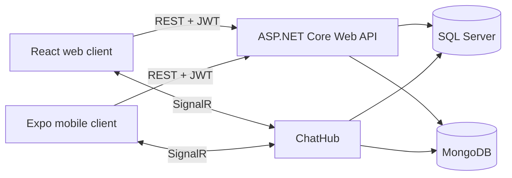
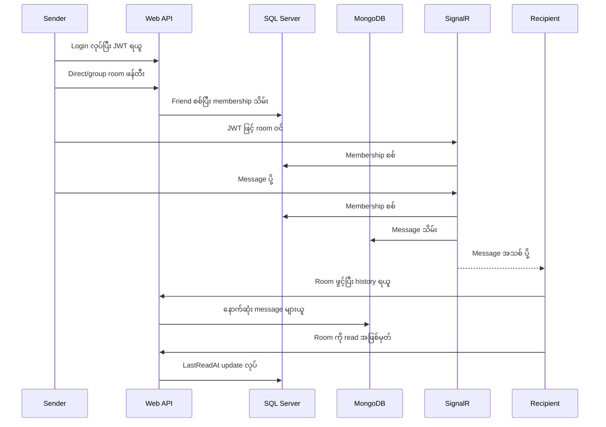

# VeloChat — Web နှင့် Mobile အတွက် Real-Time Chat

VeloChat သည် ASP.NET Core 10၊ SignalR၊ React/Vite နှင့် Expo React Native ဖြင့် တည်ဆောက်ထားသော chat app ဖြစ်သည်။ User၊ friendship၊ room membership နှင့် ဖတ်ပြီးသည့်အချိန်ကို SQL Server တွင် သိမ်းပြီး message များကို MongoDB တွင် သိမ်းသည်။ [English README](./README.md) ကိုလည်း ဖတ်နိုင်သည်။

## Project များနှင့် architecture

| Project | လုပ်ဆောင်ချက် |
| --- | --- |
| `VeloChat.WebAPI` | Authentication၊ friends၊ rooms၊ messages နှင့် SignalR hub |
| `VeloChat.Client` | React web client |
| `VeloChat.Mobile` | Android/iOS အတွက် Expo app |


```mermaid
flowchart LR
    Web[React web client] -->|REST + JWT| API[ASP.NET Core Web API]
    Mobile[Expo mobile client] -->|REST + JWT| API
    Web <-->|SignalR| Hub[ChatHub]
    Mobile <-->|SignalR| Hub
    API --> SQL[(SQL Server)]
    API --> Mongo[(MongoDB)]
    Hub --> SQL
    Hub --> Mongo
```

## လက်ရှိလုပ်ဆောင်ချက်များ

- Account ဖွင့်ခြင်း၊ login/logout၊ token refresh၊ profile ပြင်ခြင်းနှင့် password ပြောင်းခြင်း။ Mobile app သည် SecureStore မှ session ကို ပြန်ဖွင့်နိုင်သည်။
- User ရှာခြင်း၊ friend request ပို့/လက်ခံခြင်းနှင့် accepted friend နှင့် direct chat ဖွင့်ခြင်း။
- Group room ဖန်တီးခြင်း၊ ရှိပြီးသား group ထဲ accepted friend ထည့်ခြင်းနှင့် member များကြည့်ခြင်း။ Member ထည့်လိုက်သည်နှင့် ချက်ချင်းဝင်ပြီး သီးခြား invitation လက်ခံရန်အဆင့် မရှိသေးပါ။
- Real-time message၊ online status၊ typing indicator နှင့် web/mobile light/dark theme။
- Cursor ဖြင့် စာဟောင်းများ ဆက်ဖတ်ခြင်း။ API သည် တစ်ကြိမ်လျှင် ပုံမှန် ၅၀၊ အများဆုံး ၁၀၀ ပြန်ပေးပြီး client က အဟောင်းမှအသစ်သို့ ပြသသည်။
- Room တစ်ခုချင်း unread count ကြည့်ခြင်း။ Room ဖွင့်သည့်အခါ ထို member ၏ နောက်ဆုံးဖတ်ချိန်ကို update လုပ်၍ count ရှင်းသည်။
- Message history နှင့် room action များအတွက် membership စစ်ခြင်း။ Join endpoint ဖြင့် မသက်ဆိုင်သူက room ထဲ တန်းဝင်မရပါ။

Message တစ်ခုချင်း read receipt၊ push notification နှင့် file upload မရှိသေးပါ။

## Chat flow


```mermaid
sequenceDiagram
    participant A as Sender
    participant API as Web API
    participant SQL as SQL Server
    participant Mongo as MongoDB
    participant Hub as SignalR
    participant B as Recipient
    A->>API: Login လုပ်ပြီး JWT ရယူ
    A->>API: Direct/group room ဖန်တီး
    API->>SQL: Friend စစ်ပြီး membership သိမ်း
    A->>Hub: JWT ဖြင့် room ဝင်
    Hub->>SQL: Membership စစ်
    A->>Hub: Message ပို့
    Hub->>SQL: Membership စစ်
    Hub->>Mongo: Message သိမ်း
    Hub-->>B: Message အသစ် ပို့
    B->>API: Room ဖွင့်ပြီး history ရယူ
    API->>Mongo: နောက်ဆုံး message များယူ
    B->>API: Room ကို read အဖြစ်မှတ်
    API->>SQL: LastReadAt update လုပ်
```

Direct room ဖွင့်ရန် သို့မဟုတ် group ထဲ လူတစ်ယောက်ထည့်ရန် friend request ကို လက်ခံပြီးသား ဖြစ်ရမည်။ Client က room ဖွင့်သောအခါ history ကိုယူ၊ SignalR room သို့ဝင်ပြီး read အဖြစ်မှတ်သည်။ စာဟောင်းများကို `before` cursor ဖြင့် ထပ်ယူနိုင်သည်။ Unread count ကို member တစ်ယောက်ချင်းစီ၏ `LastReadAt` နောက်ပိုင်း message များမှ တွက်သည်။

## လိုအပ်ချက်များ

- .NET 10 SDK နှင့် `dotnet-ef` tool
- Node.js 18+ နှင့် pnpm 10 (repository တွင် pnpm 10.14.0 သတ်မှတ်ထားသည်)
- SQL Server နှင့် MongoDB
- Mobile အတွက် Expo Go ပါသော ဖုန်း သို့မဟုတ် Android/iOS emulator

## စက်အတွင်း စတင်အသုံးပြုခြင်း

API ၏ local development configuration တွင် SQL Server/MongoDB connection string နှင့် JWT settings သတ်မှတ်ပါ။ Production credentials ကို repository အပြင်တွင် သိမ်းပါ။ Repository root မှ migration လုပ်ပြီး API ဖွင့်ပါ။

```powershell
dotnet ef database update --project VeloChat.WebAPI
dotnet run --project VeloChat.WebAPI --launch-profile https
```

`AddRoomLastReadAt` migration သည် unread count အတွက် room membership တွင် နောက်ဆုံးဖတ်ချိန်ကို ထည့်ပေးသည်။ Checkout အဟောင်းကို update လုပ်ပြီးပါက migration command ကို run ပါ။ HTTPS profile သည် `https://localhost:7010` နှင့် local ဖုန်းစမ်းရန် `http://0.0.0.0:5027` တွင် နားထောင်သည်။ Development အချိန် Scalar API docs ကို `https://localhost:7010/scalar/v1` တွင် ကြည့်နိုင်သည်။

နောက် terminal တစ်ခုတွင် package ထည့်ပြီး web client ဖွင့်ပါ။

```powershell
pnpm install
pnpm web
```

`http://localhost:5173` ကို ဖွင့်ပါ။ Chat flow စမ်းရန် account နှစ်ခုဖွင့်၊ တစ်ခုမှ friend request ပို့၊ နောက်တစ်ခုမှ လက်ခံပြီး direct chat သို့မဟုတ် group ဖွင့်ပါ။ Browser session နှစ်ခုဖြင့် real-time message၊ typing နှင့် unread count ကို ကြည့်နိုင်သည်။

## ဖုန်းအစစ်ဖြင့် စမ်းခြင်း

1. ဖုန်းနှင့် development PC ကို Wi-Fi တစ်ခုတည်း ချိတ်ပါ။
2. `ipconfig` ဖြင့် PC ၏ Wi-Fi IPv4 address ကို ရှာပါ။
3. `VeloChat.Mobile/.env.example` ကို `VeloChat.Mobile/.env` အဖြစ် copy လုပ်ပါ။
4. `.env` ထဲတွင် `EXPO_PUBLIC_API_URL=http://<YOUR-PC-IP>:5027` ကို PC ၏ IPv4 address အမှန်ဖြင့် သတ်မှတ်ပါ။
5. Repository root မှ `pnpm mobile --clear --lan` ကို run ပါ။
6. Expo Go ဖြင့် QR code scan လုပ်ပါ။ App ချိတ်မရပါက ဖုန်း browser မှ `http://<YOUR-PC-IP>:5027/scalar/v1` ကို အရင်စမ်းပါ။

| Device | `EXPO_PUBLIC_API_URL` |
| --- | --- |
| ဖုန်းအစစ် | `http://<YOUR-PC-IP>:5027` |
| Android emulator | `http://10.0.2.2:5027` |
| iOS simulator | `http://localhost:5027` |

`.env` ပြောင်းပြီးတိုင်း Expo ကို restart လုပ်ပါ။ ဖုန်း၏ `localhost` သည် ဖုန်းကိုယ်တိုင်ကို ညွှန်းပြီး local HTTPS development certificate ကို ဖုန်းက ပုံမှန်အားဖြင့် မယုံကြည်ပါ။ Port 5027 သည် local development အတွက်ဖြစ်သည်။ Production တွင် valid certificate ပါသော HTTPS သုံးပါ။ Device setup အသေးစိတ်ကို [Mobile README](./VeloChat.Mobile/README.md) တွင် ကြည့်နိုင်သည်။

## ပြဿနာဖြေရှင်းခြင်း

| လက္ခဏာ | စစ်ဆေးရန် |
| --- | --- |
| API စမရ | SQL Server/MongoDB ဖွင့်ထားခြင်း၊ local connection string မှန်ခြင်းနှင့် migration run ပြီးခြင်းကို စစ်ပါ။ |
| Browser က local HTTPS API ကို မယုံကြည် | `dotnet dev-certs https --trust` run ပြီး browser နှင့် API ကို restart လုပ်ပါ။ |
| Mobile တွင် “Network request failed” | ဖုန်း/PC network၊ `.env` ထဲ PC IPv4၊ port 5027၊ Windows Firewall၊ VPN နှင့် Wi-Fi client isolation ကို စစ်ပါ။ `.env` ပြောင်းပြီး Expo restart လုပ်ပါ။ |
| Expo Go SDK မကိုက် | Project ၏ Expo SDK နှင့် ကိုက်သော Expo Go version သို့မဟုတ် emulator build သုံးပါ။ |
| Message real-time မပေါ် | Client နှစ်ခုလုံး login ဝင်ထားခြင်း၊ API ချိတ်ထားခြင်းနှင့် room တစ်ခုတည်း၏ member ဖြစ်ခြင်းကို စစ်ပါ။ Reload လုပ်ပြီး သိမ်းထားသော history နှင့် နှိုင်းယှဉ်ပါ။ |

## Project စစ်ဆေးရန်

```powershell
dotnet build VeloChat.WebAPI/VeloChat.WebAPI.csproj
pnpm build
pnpm typecheck
pnpm lint
```
